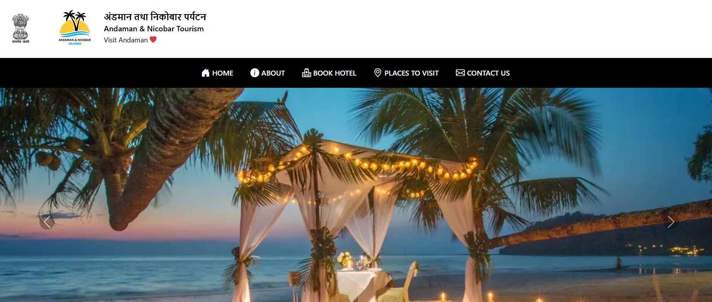
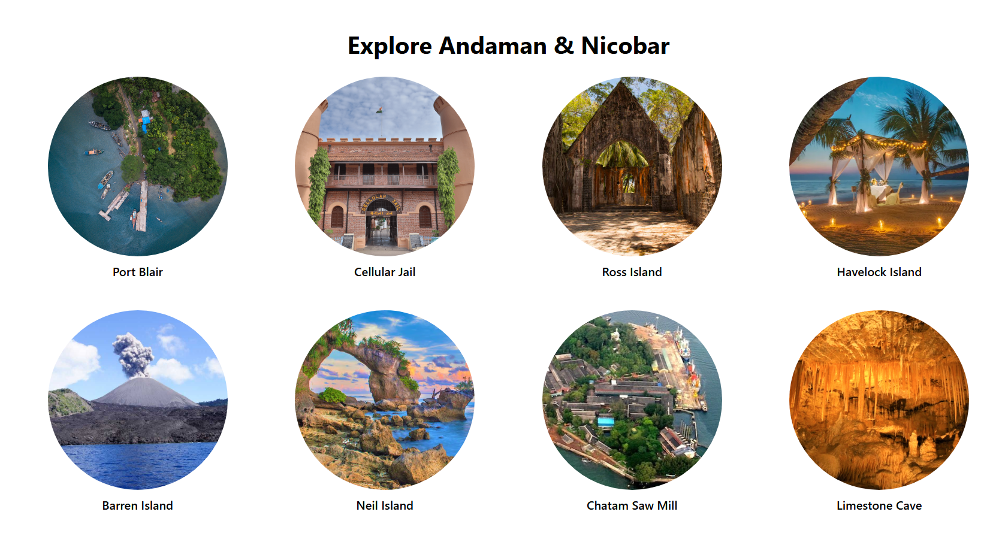
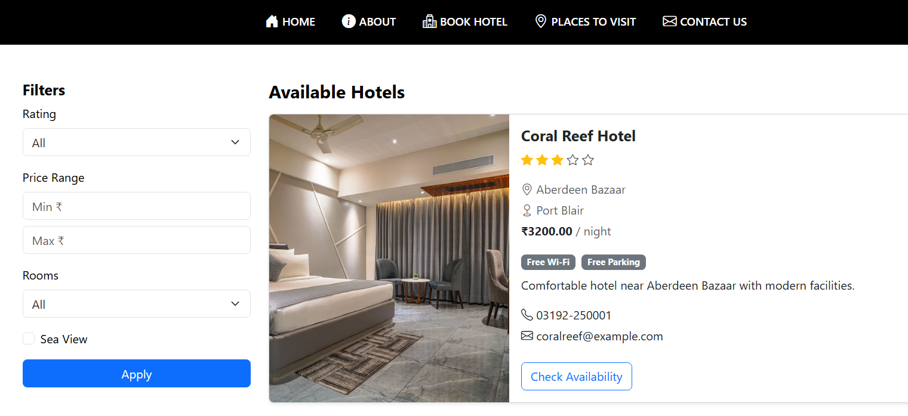

# 🏝️ VisitAndaman – Andaman & Nicobar Tourism Web Application

---

# 📸 Application Preview

## 🏠 Home Page

The landing page features a responsive Bootstrap carousel showcasing the beauty of the Andaman & Nicobar Islands.



---

## 🌴 Explore Tourist Destinations

Users can browse famous tourist attractions with detailed information and images.



---

## 🏨 Hotel Booking

Users can:

- Browse available hotels
- Filter hotels by rating, price, rooms, and sea-view
- View hotel details
- Check availability
- Book hotels online



---

# ✨ Features

### 🌍 Explore Andaman

- Browse famous tourist destinations
- Learn about islands, monuments and beaches
- View detailed information with images

---

### 🏨 Hotel Booking

- Browse hotels
- Hotel filters
  - ⭐ Rating
  - 💰 Price
  - 🌊 Sea View
  - 🏊 Swimming Pool
  - 📶 Free Wi-Fi
  - 🚗 Parking
  - 🧖 Spa
- Hotel Details Page
- Online Booking

---

### 📄 Booking Invoice

After confirming a booking, users can:

- View Booking Summary
- Download PDF Invoice

**Invoice generation is implemented using ReportLab.**

---


### 📞 Contact Page

Visitors can submit travel enquiries through the contact form.

---

### 🔐 Django Admin Panel

Manage

- Hotels
- Hotel Images
- Hotel Details
- Packages
- Package Images
- Package Bookings
- Tourist Places
- Contact Messages

---

# 🛠 Tech Stack

### Frontend

- HTML5
- CSS3
- JavaScript
- Bootstrap 5

### Backend

- Django

### Database

- MySQL

### PDF Generation

- ReportLab

---

# 📂 Project Structure

```
VisitAndaman/
│
├── main/
├── static/
├── media/
├── tourism_project/
├── manage.py
├── requirements.txt
└── README.md
```

---


# 👩‍💻 Developer

**Riya S. Menon**

Full Stack Developer | AI & Machine Learning Enthusiast
